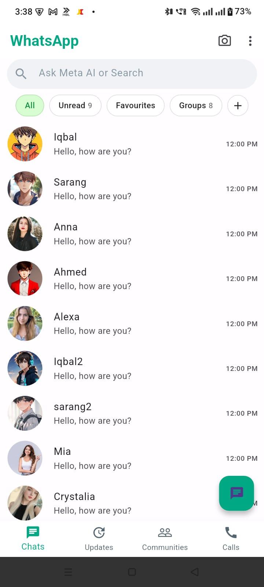

# WhatsApp UI Clone – Flutter

A pixel-perfect WhatsApp home screen UI clone built using Flutter. This project is created for learning and practicing Flutter UI development by replicating real-world app interfaces.

---

## Screenshots

| Home Screen |
|-------------|


---

## Features

- WhatsApp-style AppBar with green theme
- Search bar with modern rounded design
- Horizontal filter chips (All, Unread, Favourites, Groups)
- Chat list with avatar, name, message preview, and time
- Bottom navigation bar (Chats, Updates, Communities, Calls)
- Floating Action Button for new chat
- Clean and responsive UI

---

## Colors Used

- Primary Green: `#00A884`
- Search Background: `#F0F2F5`
- Secondary Text: `#8696A0`
- Active Chip Background: `#D9FDD3`
- Border Color: `#D1D7DB`
- Background: `#FFFFFF`

---

## Project Structure

```
lib/
├── main.dart
├── screens/
│   └── home_screen.dart
├── widgets/
│   ├── chat_tile.dart
│   ├── filter_chips.dart
│   └── bottom_nav_bar.dart
└── models/
    └── chat_model.dart
```

---

## Getting Started

Clone the repository:

```bash
git clone https://github.com/your-username/whatsapp-ui-clone.git
```

Navigate to project directory:

```bash
cd whatsapp-ui-clone
```

Install dependencies:

```bash
flutter pub get
```

Run the app:

```bash
flutter run
```

---

## Purpose

- Flutter UI practice
- Learning widget-based layout design
- Improving frontend development skills
- Cloning real-world application interfaces

---

## Disclaimer

This project is created for educational purposes only. WhatsApp is a trademark of Meta Platforms, Inc.

---

## Author

Muhammad Iqbal  
GitHub: https://github.com/iqballakho07
